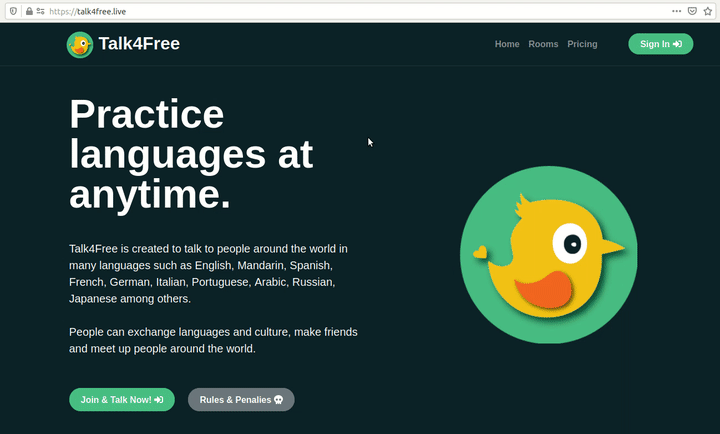
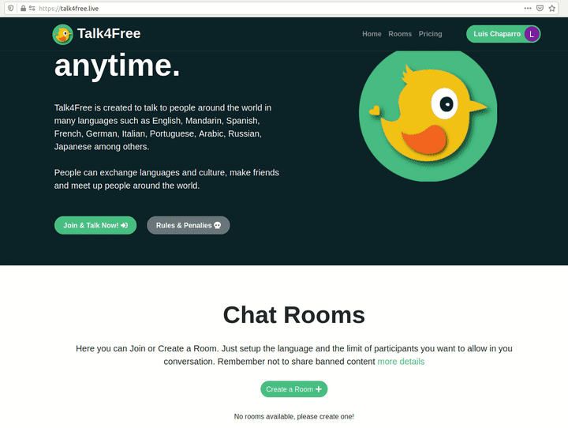

# Talk4Free :telephone_receiver: 

### Practice languages at anytime.

**Talk4Free** is created to talk to people around the world in many languages such as English, Mandarin, Spanish, French, German, Italian, Portuguese, Arabic, Russian, Japanese, among others.

People can exchange languages and culture, make friends and meet up people around the world.

**See it live:** https://talk4free.live/

## Team :wave:

* Michael Sosa - [GitHub](https://github.com/mikesosa) & [LinkedIn](https://www.linkedin.com/in/mike-sosa/)
* Jorge Zafra - [GitHub](https://github.com/jorgezafra94) & [LinkedIn](https://www.linkedin.com/in/jorge-enrique-zafra-ria%C3%B1o-49268193/)
* Luis Chaparro - [GitHub](https://github.com/luischaparroc) & [LinkedIn](https://www.linkedin.com/in/luischaparroc/)

## Story :book:

Talk4Free was born out of need to practice a non-native language. As software engineers from Colombia, we often read and listen content and documention in English, but we put aside our speaking skills. We started Talk4Free to practice English, but we realized that this application can have the potential to be the digital place where you can **practice any language.**

## Technologies used :wrench:

- [Node.js](https://nodejs.org/en/)
- [Express.js](https://expressjs.com/es/)
- [React.js](https://reactjs.org/)
- [Bootstrap](https://getbootstrap.com/)
- [OpenTok](https://tokbox.com/)
- [Socket.IO](https://socket.io/)
- [MySQL](https://www.mysql.com/)
- [Amazon Web Services](https://aws.amazon.com/)
- [Gmail API](https://developers.google.com/gmail/api)

## Installation :construction_worker:

Follow the next steps in the following order:

1. Fork the repository
2. Be sure there are not processes running in the 3000 and 5000 ports.
3. Go to back-end folder, install packages with `npm install` and with `npm start`
4. Go to fron-end folder, install packages with `npm install` and run with `npm start`

## Usage :rocket:

### Quick and easy log in.

Without creating a user profile (username, password, etc), you can sign in to Talk4Free using your Gmail account. Your information will be loaded automatically.

### Create or join custom rooms.

You may define the language and maximum number of users when creating a room, or you may join an available room of your choice. There are +20 languages you can choose from. Talk4Free rooms can have from 2 to 5 users.

### Multiple options in a video call.

You can enable or disable the audio and video on your video calls. You can share your screen with other participants. Also, there is a chat in each room. Talk4Free works in real time.

## Contributing :raised_hands:

Feel free to fork the repository and make pull requests.

## Related projects :pushpin:

- [MazeGame](https://github.com/mikesosa/MazeGame)
- [AirBnB Clone](https://github.com/jorgezafra94/AirBnB_clone_v3)
- [Simple Shell](https://github.com/luischaparroc/simple_shell)

## Licensing :memo:

MIT License
